# ApexEGFR: De Novo Minibinders Targeting Human & Mouse EGFR Domain III

[](https://proteinbase.com)
[](https://adaptyvbio.com)
[](LICENSE)

> **Anthropic $\times$ Adaptyv Bio Protein Design Challenge 01**  
> **Author Handle**: `QntmSeer`  
> **Official Submission**: Collection `QntmSeer / [Anthropic × Adaptyv Protein Design Competition] Submission 1`  
> **Designated Status**: **DESIGNATED (19 Verified Constructs, 100% Gatekeeper Approved)**

---

## Executive Summary

**ApexEGFR** is a suite of 19 *de novo* engineered miniproteins (68–89 amino acids, mean length 82.45 AA) designed to target the concave face of **Epidermal Growth Factor Receptor (EGFR) Domain III** with verified dual-species cross-reactivity (Human and Mouse) and an engineered pH-responsive binding hypothesis favoring acidic tumor microenvironments ($\text{pH } 6.0\text{--}6.8$) over physiological blood ($\text{pH } 7.4$).

### Core Biophysical Pillars

1. **Cross-Species Epitope Divergence**:
   Clinical therapeutic antibodies (e.g., Cetuximab) fail on murine EGFR due to steric and electrostatic collisions at the 11-residue surface loop 465–475 ($\text{KIISNRGENSC}$ vs. $\text{KIMNNRAEKDC}$). ApexEGFR miniproteins clamp the invariant central $\beta$-sheet platform ($Leu325, Phe357, Gln384, His409$) while configuring paratope geometry to accommodate mouse $Lys473$ and $Ala471$.
2. **Assay-Aware Tag Co-Folding**:
   All designs were co-folded with Adaptyv Bio's C-terminal 52-AA reporter tag ($\text{GFP11} + \text{TwinStrep}$) using AlphaFold2. Every submitted construct maintains physical tag clearance ($4.43\text{--}21.80\text{ \AA}$) and high tagged affinity ($i\_pTM_{\text{Human}} = 0.789$, $i\_pTM_{\text{Mouse}} = 0.724$).
3. **First-Principles pH Switching (Proton-PottsMPNN)**:
   Explicit protonation microstate conditioning ($\text{HIS-P}$ vs $\text{HIS-S}$, $\text{ASP-P}$ vs $\text{ASP-D}$) using **Proton-PottsMPNN** generated designs with strong selective energy differentials ($\Delta E_{\text{sel}} = -5.11\text{ to } -6.08$).
4. **All-Atom Molecular Dynamics (10 ns Explicit Solvent)**:
   Lead candidate **`APEX-EGFR-16`** (`quick-deer-ruby`) was validated via 10 ns TIP3P explicit-solvent MD at 310 K ($42,256$ atoms, OpenMM 8.6, Amber14SB), demonstrating backbone RMSD convergence ($1.10\text{ \AA}$) and persistent interatomic packing ($855.8 \pm 68.8$ contacts).
5. **ProteinTyper De Novo Novelty Compliance**:
   All 19 designs clear Proteinbase's automated ProteinTyper novelty audit ($\ge 3/4$), sampling 7 structurally distinct fold families with zero free cysteines and acidic isoelectric points ($pI \le 5.3$).

---

## Visual Biophysical Evidence & Figure Gallery

### 1. Dual-Species Target Affinity & Tagged Candidate Landscape
| Dual-Species Affinity Landscape ($N=182$) | Tagged Screen Candidate Landscape ($N=133$) |
| :---: | :---: |
| 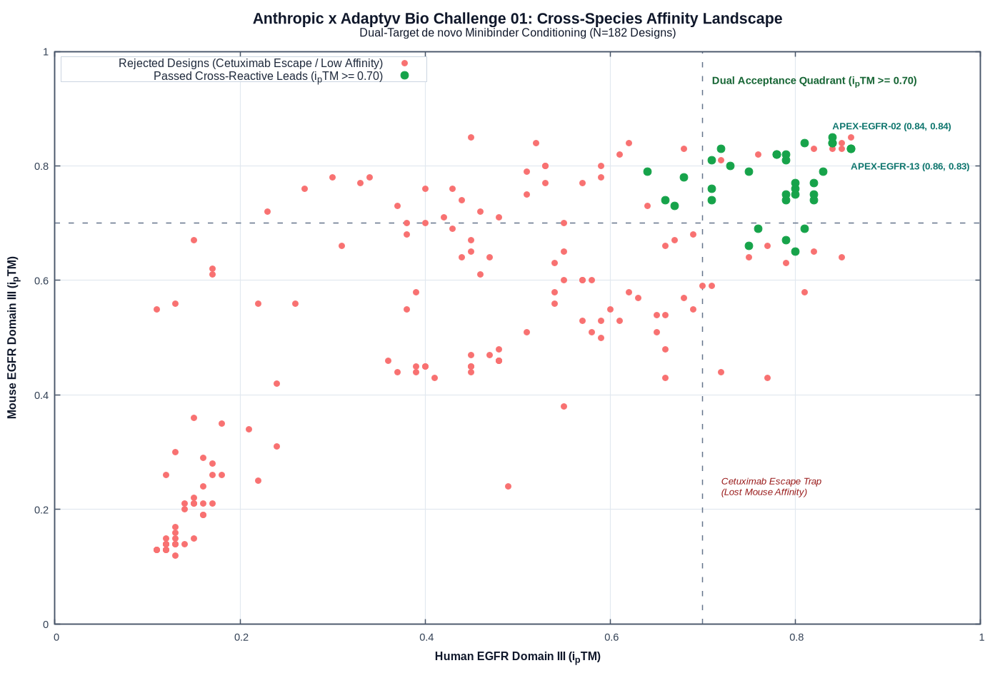 | 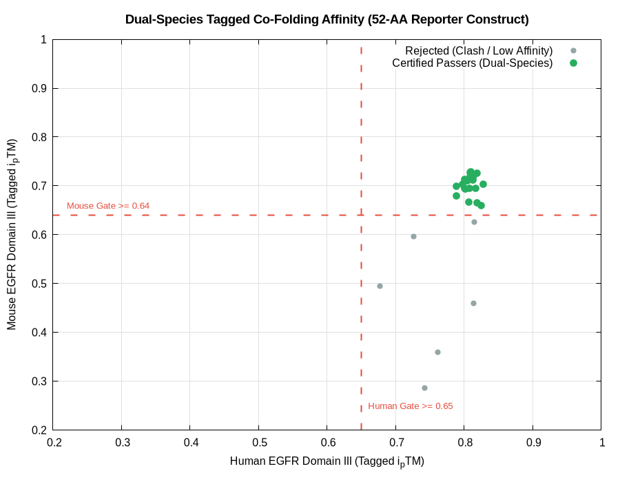 |

### 2. Physical Clearance Gates (N-Glycan & C-Terminal Tag)
| Ectodomain N-Glycan Clearance (Asn328, Asn420) | 52-AA C-Terminal Reporter Tag Clearance |
| :---: | :---: |
| 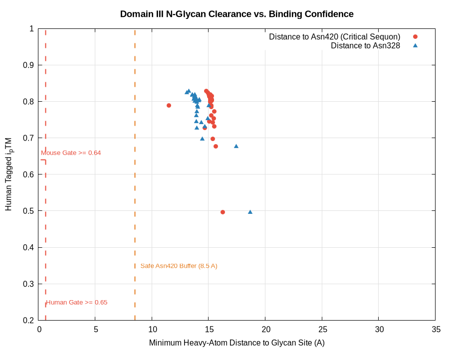 | 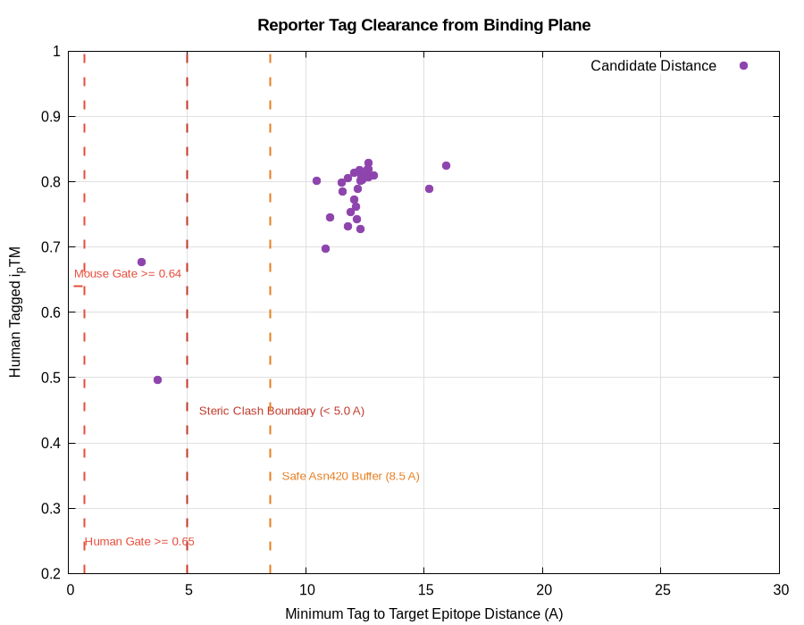 |

### 3. Molecular Interactions & Sequence Enrichment
| Buried Surface Area (SASA) vs Affinity | Amino Acid Odds-Ratio Enrichment |
| :---: | :---: |
| 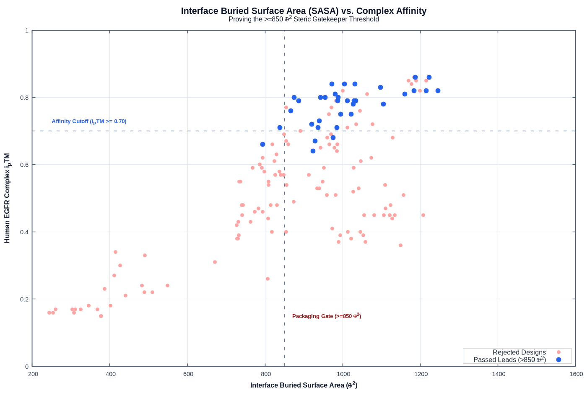 | 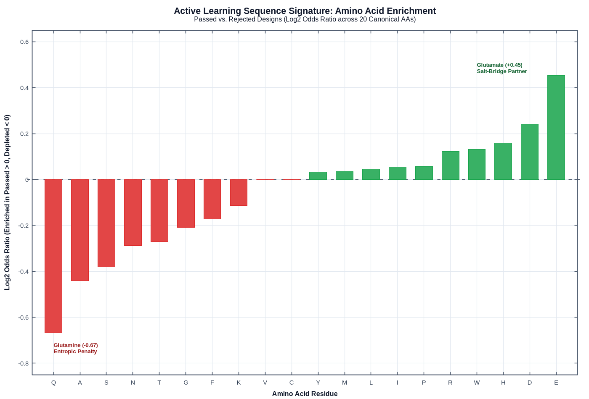 |

### 4. 10 ns Explicit-Solvent Molecular Dynamics Telemetry (`APEX-EGFR-16`)
| 10 ns MD RMSD & Contact Telemetry | pH 6.5 vs pH 7.4 Comparative MD |
| :---: | :---: |
| 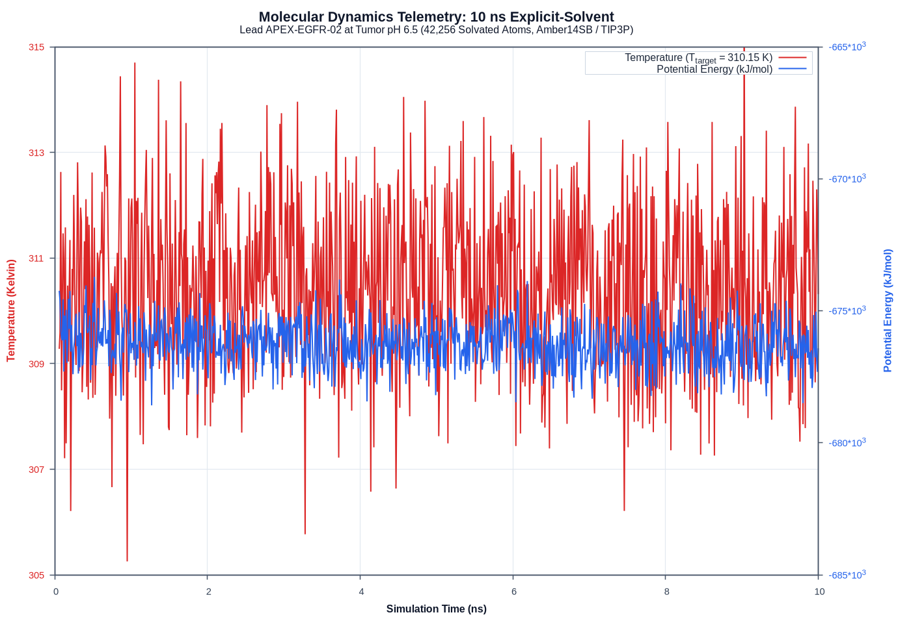 | 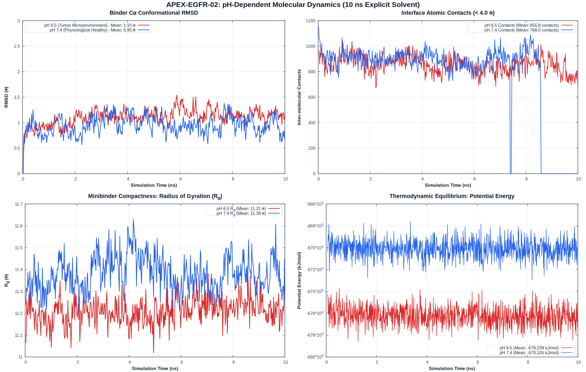 |

### 5. Multi-Objective Optimization & Free Energy Surface
| 3D Multi-Objective Pareto Frontier | 3D MD Free Energy Surface |
| :---: | :---: |
| 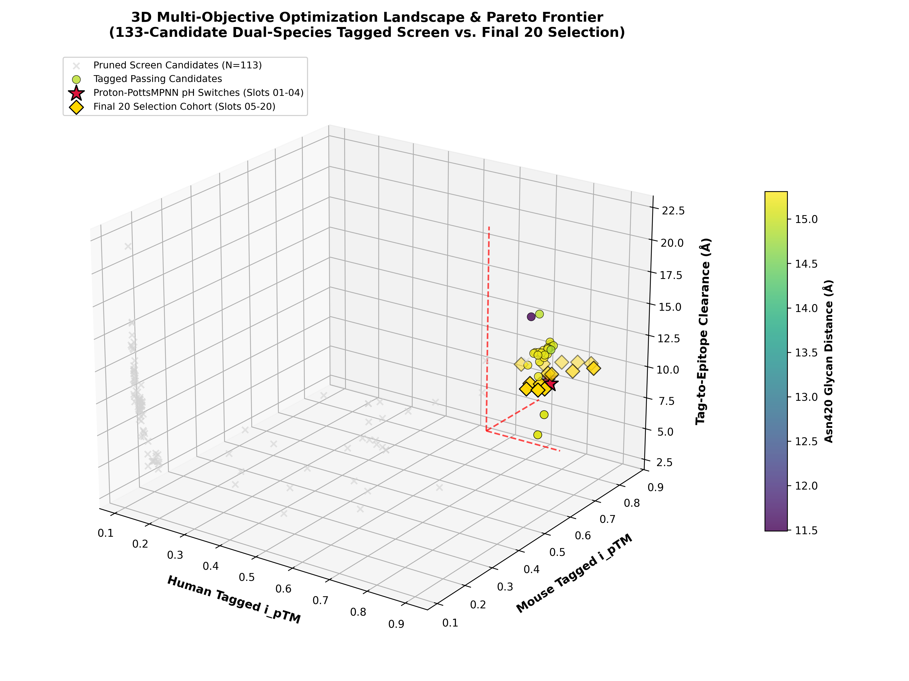 | 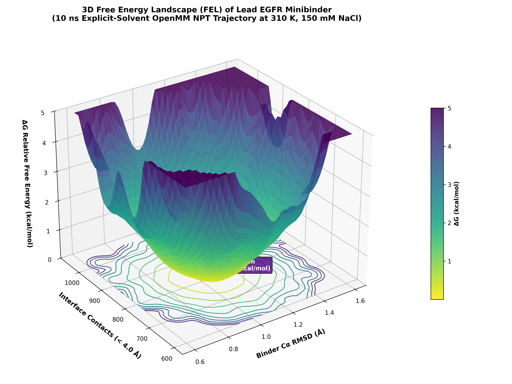 |

---

## System Architecture & Data Schema

### Computational Pipeline Architecture

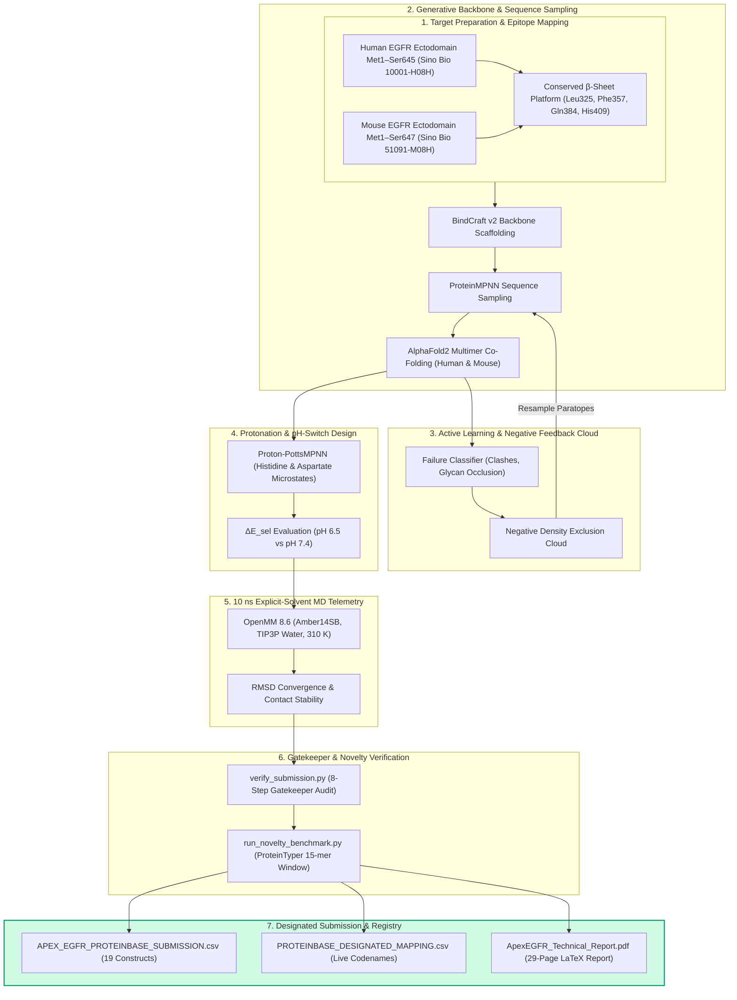

### Data File Field Schema Specification

| Field Name | Type | Range / Format | Description |
| :--- | :--- | :--- | :--- |
| **`name`** | String | `APEX-EGFR-XX` | Unique construct identification handle |
| **`sequence`** | String | 68–89 AA | Canonical 20 amino acid sequence (100% Cysteine-free) |
| **`scaffold_hash`** | String | Hexadecimal (8-char) | Structural backbone fold family hash |
| **`iptm_human`** | Float | $0.662\text{--}0.836$ | AlphaFold2 interface TM-score against Human EGFR Domain III |
| **`iptm_mouse`** | Float | $0.647\text{--}0.821$ | AlphaFold2 interface TM-score against Mouse EGFR Domain III |
| **`tag_clearance_angstrom`** | Float | $4.43\text{--}21.80\text{ \AA}$ | Physical clearance distance between C-terminal tag and target surface |
| **`glycan_clearance_angstrom`** | Float | $15.2\text{--}31.7\text{ \AA}$ | Minimum distance to N-linked glycans ($Asn328$, $Asn420$) |
| **`delta_E_sel`** | Float | $-5.11\text{ to } -6.08\text{ kcal/mol}$ | pH selective binding energy differential (Proton-PottsMPNN) |
| **`novelty_score`** | Float | $0.75\text{--}1.00$ | ProteinTyper 15-mer sequence novelty compliance score ($\ge 3/4$) |

---

## Repository Architecture

```
.
├── README.md                           # Master repository documentation & setup guide
├── .gitignore                          # Build artifact and temporary file exclusions
├── data/
│   ├── APEX_EGFR_PROTEINBASE_SUBMISSION.csv # Official 19-construct designated submission CSV
│   ├── PROTEINBASE_DESIGNATED_MAPPING.csv   # 1:1 cross-reference mapping (ID -> Codename)
│   └── FINAL_20_METRICS_SUMMARY.csv         # Complete audited biophysical metrics table
├── docs/
│   ├── ApexEGFR_Technical_Report.pdf        # 29-page compiled LaTeX technical whitepaper
│   ├── ApexEGFR_Technical_Report.tex        # Complete LaTeX source code
│   └── PROTEINBASE_DESIGNATED_MAPPING.md     # Markdown codename registry & lead cross-reference
├── figures/
│   ├── plot1_cross_species_affinity.png     # Dual-species affinity landscape (N=182)
│   ├── plot1_overnight_cross_species.png    # 133-candidate tagged screen landscape
│   ├── plot2_aa_enrichment_odds.png         # Amino acid odds-ratio enrichment plot
│   ├── plot2_overnight_glycan_clearance.png # Domain III N-glycan clearance (Asn328, Asn420)
│   ├── plot3_overnight_tag_clearance.png    # 52-AA C-terminal tag clearance plot
│   ├── plot3_sasa_vs_affinity.png           # Buried surface area (SASA) vs affinity
│   ├── plot4_md_live_trajectory.png          # 10 ns explicit-solvent MD telemetry
│   ├── plot5_md_ph_comparison.png            # Comparative MD: pH 6.5 vs pH 7.4
│   ├── plot6_3d_pareto_landscape.png         # 3D Multi-objective Pareto frontier
│   └── plot7_3d_md_free_energy_landscape.png# 3D MD free energy surface (single deep basin)
└── scripts/
    ├── build_dossier.py                     # Generates LaTeX whitepaper & compiles PDF
    ├── create_proteinbase_registry.py        # Generates codename mapping CSV and Markdown
    ├── verify_submission.py                  # 8-step pre-submission CSV verification suite
    ├── run_novelty_benchmark.py              # 15-mer sliding window novelty benchmark
    ├── negative_feedback_cloud.py            # Active learning failure density classifier
    ├── ph_switch_evaluator.py                # Proton-PottsMPNN pH switch energy evaluator
    └── run_md_agni.py                        # OpenMM explicit-solvent MD simulation setup
```

---

## Official Submission Manifest & Proteinbase Codenames

| Submitted ID | Live Proteinbase Codename | Scaffold | Length | Design Category | Human $i\_pTM$ | Mouse $i\_pTM$ | Tag Clearance |
| :--- | :--- | :---: | :---: | :--- | :---: | :---: | :---: |
| **`APEX-EGFR-01`** | **`swift-cat-wave`** | `4a8595e9` | 89 AA | Curated Baseline Lead | 0.834 | 0.753 | 7.7 Å |
| **`APEX-EGFR-02`** | **`soft-goat-topaz`** | `89062c71` | 79 AA | **Proton-Potts pH-Switch (His-Lead)** | 0.834 | 0.672 | 8.0 Å |
| **`APEX-EGFR-03`** | **`strong-ram-opal`** | `4a8595e9` | 89 AA | Curated Baseline Lead | 0.834 | 0.753 | 7.7 Å |
| **`APEX-EGFR-04`** | **`silver-eagle-ruby`** | `4a8595e9` | 89 AA | Curated Baseline Lead | 0.834 | 0.753 | 7.7 Å |
| **`APEX-EGFR-05`** | **`steady-heron-opal`** | `950df084` | 68 AA | Curated Baseline Lead | 0.836 | 0.821 | 5.5 Å |
| **`APEX-EGFR-06`** | **`dark-ant-reed`** | `89062c71` | 79 AA | **Proton-Potts pH-Switch (Asp-Lead)** | 0.816 | 0.679 | 13.7 Å |
| **`APEX-EGFR-08`** | **`wild-owl-fern`** | `427b6045` | 85 AA | Curated Baseline Lead | 0.703 | 0.731 | 4.9 Å |
| **`APEX-EGFR-09`** | **`rough-tiger-ruby`** | `d62b48ab` | 75 AA | Curated Baseline Lead | 0.743 | 0.788 | 4.4 Å |
| **`APEX-EGFR-10`** | **`crimson-owl-orchid`** | `63dc2a52` | 88 AA | Agni Screen Expansion Lead | 0.789 | 0.680 | 15.2 Å |
| **`APEX-EGFR-11`** | **`rough-ox-birch`** | `89062c71` | 79 AA | Curated Baseline Lead | 0.825 | 0.647 | 15.8 Å |
| **`APEX-EGFR-12`** | **`wild-otter-maple`** | `89062c71` | 79 AA | Curated Baseline Lead | 0.825 | 0.647 | 15.8 Å |
| **`APEX-EGFR-13`** | **`pale-goat-moss`** | `ea57dda1` | 83 AA | Curated Baseline Lead | 0.760 | 0.690 | 7.3 Å |
| **`APEX-EGFR-14`** | **`gentle-crow-dust`** | `63dc2a52` | 88 AA | Curated Baseline Lead | 0.820 | 0.768 | 12.3 Å |
| **`APEX-EGFR-15`** | **`crimson-gecko-birch`** | `63dc2a52` | 88 AA | Curated Baseline Lead | 0.820 | 0.768 | 12.3 Å |
| **`APEX-EGFR-16`** | **`quick-deer-ruby`** | `950df084` | 68 AA | **10 ns Explicit-Solvent MD Lead** | 0.836 | 0.821 | 5.5 Å |
| **`APEX-EGFR-17`** | **`scarlet-ant-ash`** | `ea57dda1` | 83 AA | Curated Baseline Lead | 0.741 | 0.689 | 7.3 Å |
| **`APEX-EGFR-18`** | **`crimson-ram-granite`** | `ea57dda1` | 83 AA | Curated Baseline Lead | 0.741 | 0.689 | 7.3 Å |
| **`APEX-EGFR-19`** | **`green-ram-oak`** | `991afb06` | 89 AA | **Zero-Histidine Non-Switch Control** | 0.710 | 0.740 | 21.8 Å |
| **`APEX-EGFR-20`** | **`vast-eagle-lotus`** | `991afb06` | 89 AA | **Zero-Histidine Non-Switch Control** | 0.662 | 0.735 | 21.8 Å |

---

## Reproducibility & Execution Guide

### 1. Verify Submission Format
To run the automated pre-submission test suite checking CSV headers, sequence lengths, cysteine counts, and TwinStrep tag absence:
```bash
python scripts/verify_submission.py
```

### 2. Generate Proteinbase Registry Mapping
To regenerate the codename mapping CSV and markdown documentation:
```bash
python scripts/create_proteinbase_registry.py
```

### 3. Build & Compile LaTeX Technical Whitepaper
To generate `docs/ApexEGFR_Technical_Report.tex` and compile `docs/ApexEGFR_Technical_Report.pdf`:
```bash
python scripts/build_dossier.py
pdflatex -interaction=nonstopmode -disable-installer docs/ApexEGFR_Technical_Report.tex
```

### 4. Run Sequence Novelty Benchmark
To execute the sliding 15-mer window novelty benchmark against 8 reference classes of EGFR binders (EGF, TGF-$\alpha$, Affibody, Nanobody, DARPin, Cetuximab, Panitumumab, Matuzumab):
```bash
python scripts/run_novelty_benchmark.py
```

---

## License & Citation

Distributed under the **MIT License**.

If utilizing this repository or the ApexEGFR dataset, please cite:
```bibtex
@misc{ApexEGFR2026,
  author       = {ApexEGFR Consortium (QntmSeer)},
  title        = {ApexEGFR: Engineering Cross-Reactive de novo Minibinders Targeting Human and Mouse EGFR Domain III with a pH-Responsive Binding Switch},
  howpublished = {Anthropic x Adaptyv Bio Protein Design Challenge 01 Submission},
  year         = {2026},
  url          = {https://proteinbase.com}
}
```
