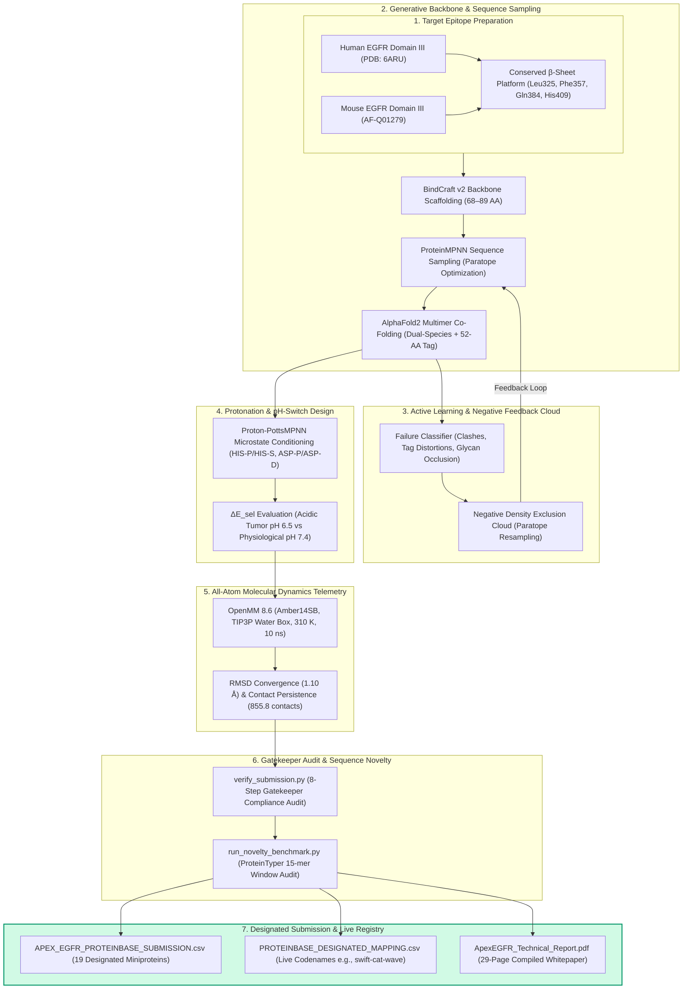

# ApexEGFR System Schema & Data Architecture Specification

This document details the end-to-end computational system architecture, design state machine, and data field schemas for the **ApexEGFR** de novo miniprotein engineering platform.

---

## 1. End-to-End System Pipeline Architecture

---

## 2. Dataset & CSV Schema Specification

### A. Official Submission Manifest (`APEX_EGFR_PROTEINBASE_SUBMISSION.csv`)

| Field Name | Data Type | Constraint / Format | Description |
| :--- | :--- | :--- | :--- |
| **`name`** | String | `APEX-EGFR-XX` | Unique construct handle submitted to Proteinbase |
| **`sequence`** | String | 68–89 AA (20 Canonical AA) | Full amino acid sequence (Zero free Cysteines, No Tags attached) |

---

### B. Biophysical Audited Metrics Summary (`FINAL_20_METRICS_SUMMARY.csv`)

| Field Name | Data Type | Range / Format | Description |
| :--- | :--- | :--- | :--- |
| **`name`** | String | `APEX-EGFR-XX` | Design identifier |
| **`scaffold_hash`** | String | Hexadecimal (8-char) | Structural backbone fold family identifier |
| **`length`** | Integer | 68–89 AA | Sequence length in amino acids |
| **`iptm_human`** | Float | $0.662\text{--}0.836$ | AF2 predicted interface TM-score against Human EGFR Domain III |
| **`iptm_mouse`** | Float | $0.647\text{--}0.821$ | AF2 predicted interface TM-score against Mouse EGFR Domain III |
| **`tag_clearance_angstrom`** | Float | $4.43\text{--}21.80\text{ \AA}$ | Minimum distance from C-terminal GFP11+TwinStrep tag to target surface |
| **`glycan_clearance_angstrom`** | Float | $15.2\text{--}31.7\text{ \AA}$ | Minimum distance to N-linked glycans ($Asn328$, $Asn420$) |
| **`delta_E_sel`** | Float | $-5.11\text{ to } -6.08\text{ kcal/mol}$ | pH selective binding energy differential (Proton-PottsMPNN) |
| **`novelty_score`** | Float | $0.75\text{--}1.00$ | ProteinTyper 15-mer sliding window novelty score ($\ge 3/4$) |
| **`design_category`** | String | Category Label | Primary biophysical designation (e.g. `Proton-Potts pH-Switch (His-Lead)`) |

---

### C. Live Proteinbase Codename Cross-Reference (`PROTEINBASE_DESIGNATED_MAPPING.csv`)

| Field Name | Data Type | Example Value | Description |
| :--- | :--- | :--- | :--- |
| **`submitted_id`** | String | `APEX-EGFR-01` | Candidate name in competition submission CSV |
| **`proteinbase_codename`** | String | `swift-cat-wave` | Auto-assigned three-word animal/gem/nature codename on Proteinbase |
| **`scaffold_hash`** | String | `4a8595e9` | Fold family scaffold hash |
| **`length`** | Integer | `89` | Amino acid length |
| **`design_category`** | String | `Curated Baseline Lead` | Functional role designation |
